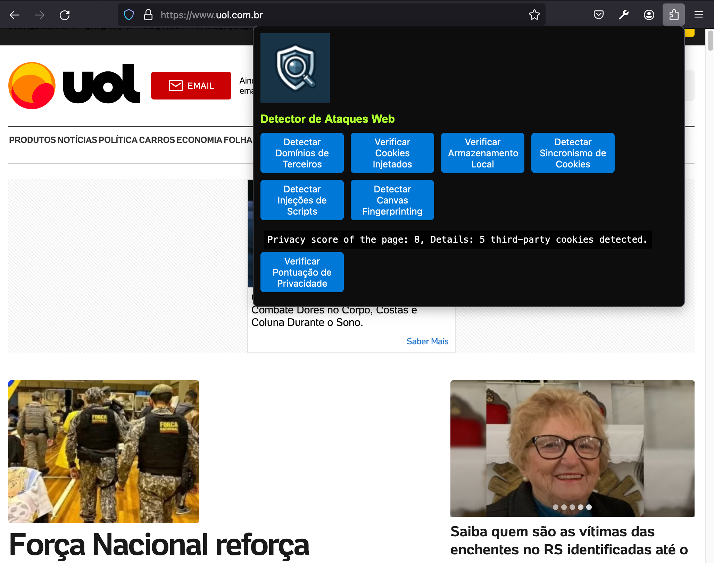

# Detector de Ataques Web

## Descrição
O "Detector de Ataques Web" é uma extensão do Firefox projetada para melhorar a segurança do usuário enquanto navega na internet. Ela monitora e analisa o comportamento do site em tempo real para identificar e alertar sobre potenciais ameaças de segurança, como hijacking, cookies de terceiros, uso inseguro de armazenamento e sincronismo de cookies. Esta ferramenta é essencial para proteger a privacidade do usuário e garantir uma experiência de navegação segura.

## Funcionalidades
- **Verificar Segurança**: Analisa a página em busca de comportamentos suspeitos e potenciais vulnerabilidades, como conexões não seguras e a presença de cookies de terceiros.
- **Detectar Domínios de Terceiros**: Identifica e lista todos os domínios de terceiros que são carregados na página atual, ajudando a entender quais recursos podem estar rastreando o usuário.
- **Verificar Cookies**: Conta e reporta o número de cookies de primeira e terceira parte encontrados na página, categorizando-os em cookies de sessão e persistentes.
- **Verificar Armazenamento Local e de Sessão**: Examina o uso detalhado de `localStorage` e `sessionStorage`, mostrando todas as chaves e valores armazenados, que podem ser usados para rastreamento ou armazenamento inseguro de informações.
- **Detectar Injeções Maliciosas**: Verifica a presença de scripts maliciosos ou de terceiros injetados que não se originam do domínio principal da página, um vetor comum para ataques de cross-site scripting (XSS).
- **Calculadora de Pontuação de Privacidade**: Avalia a segurança da página atual e fornece uma pontuação de privacidade com base nos elementos analisados, como a presença de cookies de terceiros e se a conexão é segura (HTTPS).

## Instalação
1. Clone este repositório ou baixe os arquivos da extensão.
2. Abra o Firefox e acesse `about:debugging`.
3. Clique em "This Firefox" (ou "Este Firefox").
4. Clique em "Load Temporary Add-on" e selecione o arquivo `manifest.json` dentro da pasta da extensão baixada.
5. A extensão agora está instalada temporariamente em seu navegador e pode ser testada.

## Uso
Após a instalação, clique no ícone da extensão na barra de ferramentas do Firefox para abrir o popup. Você terá acesso aos botões que ativam cada uma das funcionalidades listadas acima. Clique em qualquer um deles para realizar a verificação correspondente.

## Contribuindo
Contribuições são sempre bem-vindas! Se você tem sugestões para melhorar esta extensão, sinta-se à vontade para abrir um issue ou enviar um pull request.

## Licença
Este projeto é distribuído sob a licença MIT. Veja o arquivo `LICENSE` para mais detalhes ou visite [MIT License](https://opensource.org/licenses/MIT).
